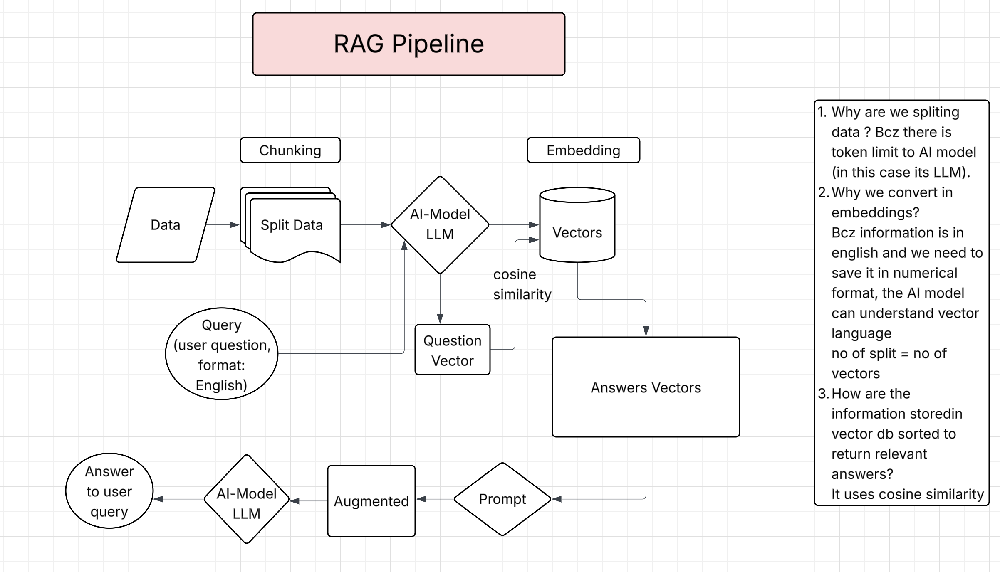

```
AUTHOR: Supriya Jadhav

Version: 1.0

Date: Sept 2025

© 2025 Supriya Sampat Jadhav. All rights reserved.
```

## What is RAG

RAG stands for Retrieval Augmented Generation, which is a technique that connects the extrnal data sources to LLMs which helps enhance it's output. RAG provides foundation models (FMs) access to additional data they didn’t have during training. This data is used to enrich the generative AI prompt to deliver more context-specific and accurate responses without continuously retraining the foundational model. RAG enables AI systems to produce more accurate and contextually relevant responses.

## Why use RAG

The AI model LLM is a very powerful model but it comes with limitations as follows. 

1. Limited knowledge: LLMs can only generate responses based on their training data, which may be outdated or lack domain-specific information.
2. Hallucinations: These models sometimes generate plausible-sounding but incorrect information.
3. Generic responses: Without access to external sources, LLMs may provide vague or imprecise answers.

RAG addresses these issues by allowing models to retrieve up-to-date and domain-specific information from structured and unstructured data sources, such as databases, documentation, and APIs.

### Usecase:
Create Large Language application chatbot on company policy documents (internal doc storage)

- Retrieval ======> Fetching the data
- Augmented ======> Combines the data

I will provid some instructions(Prompt) to chatbot, based on that instructions(prompt) you combine the output data: 
- AI model ========> human brain
- Generation ========> Provide the output

Suppose the database has terabytes of files of data, and the chatbot is expected to serach through all the documents in database. But the every chatbot has token limit hence it cannot go though all the files in the database.  
1. Search by keyword/relevance: One of the traditional ways is to search the title of the document and its contents, rank them based on the relevance. 
Limitation:
For every search, it needs to go through entore terabytes of documents. This is not efficient way.

2. Pre-process by summay : Another way is to preprocess the docuemnts, by summarize the contents into searchable chunks. But this will not always give the accurate results.

We will have unified approach meaning combining the above two methods.

### RAG System



The core idea behind LLM is that it takes input as word embedding. Meaning human language is converted to numerical representation because computers cannot think in words but in numbers. 
Now we will store the Terabytes of data into vector embedding preserving the semantics, and store them into a vector database. This way we don't need to go through the Terabytes of documents, our search will be faster because we split the information into chunks in the vector database.
1. Retrival : Once the user asks question by giving prompt to the chatbit, the question is converted into the vector embedding (because that's the language AI model understand). Now the question is compared against the vector embedding of the documents. This type of serach is called the semantic serach. 
2. Augmented : The retrived data from Step 1 is injected into the prompt at runtime, this is the additional data provided to the AI model which is not part of it's the training data. The training data can become outdated evry fats or may not have access to the latest data. This way RAG provides the up-to-date information from the vector databse, which is private data knowledge without needting to fine-tune the AI model and modify the Large Language model. 
3. Generation : AI assistant generates the response given the semantic relevant data retrived from the vector database.

Legal documents will have different stretegy vs the customer support docuemnts. <br>
Chunking strategy =====> Embedding strategy =====> Retrival strategy


#### Embedding 

We need to split the data into parts thats in the digesting form. It's called Embedding.<br>
Why we are spliting the data ? Bcz of the token limit<br>
Embeddings =====> information stored in the form of Vectors<br>
|Male| Female|
|----|-------|
| 1  |   0   |   ===== Encoding <br>

Example: <br>
Step 1 : Qn should convert into vector<br>
Step 2 : Qn vector will go to databses (v1,v2,v3,v4)<br>
         Cosine similarity<br>
         Qn  vs  V1    =   90%<br>
         Qn  vs  V2    =   70%<br>
         Qn  vs  V3    =   <br>
         Qn  vs  V4<br>


Step 1 : Data divide into chunks <br>
Step 2 : These chunks are going to LLM model and convert into vectors <br>
Step 3 : These vectors stored into databases <br>
step 4 : when a user asking a qn, it is also convert into vector <br>
Step 5 : Based on Cosine similarity, the suitable answer vectors will retrieval <br>
Step 6 : Based on prompt model will combine and generate the answer <br>

#### Cosine similarity formula
The cosine similarity between two vectors A and B is calculated using the following formula:<br>
Cosine Similarity (A, B) = (A · B) / (||A|| * ||B||)<br>
In this formula, A · B represents the dot product of vectors A and B. This is calculated by multiplying the corresponding components of the two vectors and summing up the results. ||A|| represents the Euclidean norm (magnitude) of vector A, which is the square root of the sum of the squares of its components. It’s calculated as ||A|| = √(A₁² + A₂² + … + Aₙ²). ||B|| represents the Euclidean norm (magnitude) of vector B, calculated in the same way as ||A||.<br>
How to calculate cosine similarity<br>
To calculate cosine similarity, you first complete the calculation for the dot product of the two vectors. Then, divide it by the product of their magnitudes. The resulting value will be in the range of -1 to 1, where:<br>
- If the cosine similarity is 1, it means the vectors have the same direction and are perfectly similar.<br>
- If the cosine similarity is 0, it means the vectors are perpendicular to each other and have no similarity.<br>
- If the cosine similarity is -1, it means the vectors have opposite directions and are perfectly dissimilar.<br>

